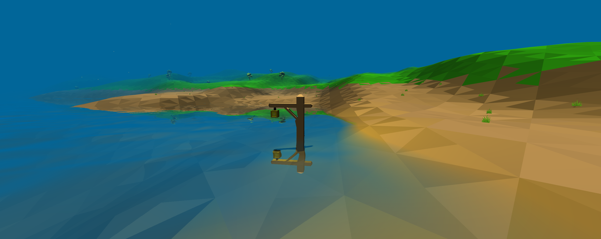

# 👋 Hello!

My name is Menno and i'm a third year student at Avans Hogeschool in the Netherlands studying Technical Informatics.

## 🌱 I'm currently learning:
- Graphics programming
- Unity VR

## 👷 Current project(s):
- My own graphics engine "ByteCat"
- A VR game "TaskRush"

## 📈 Github Stats:

---

